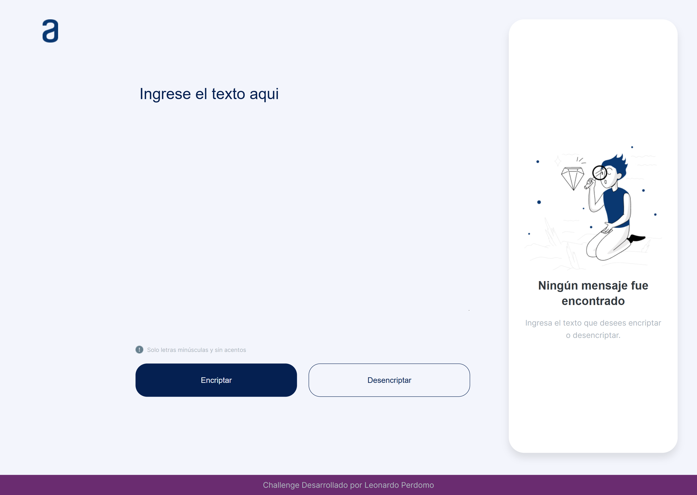
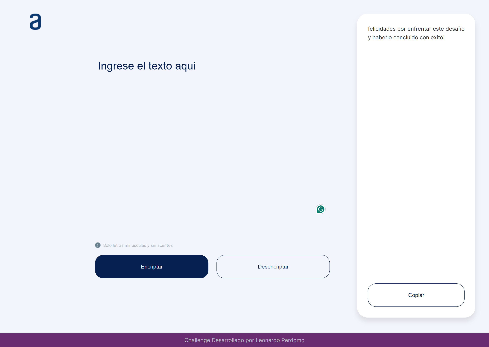
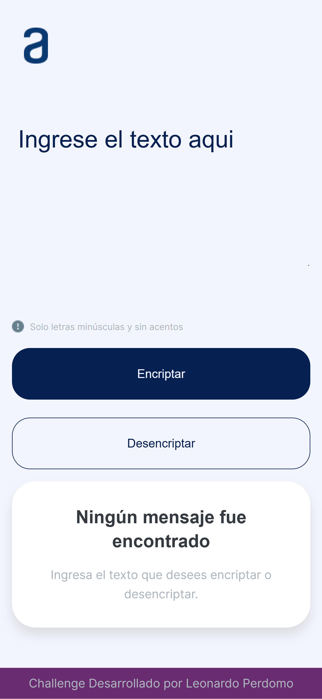
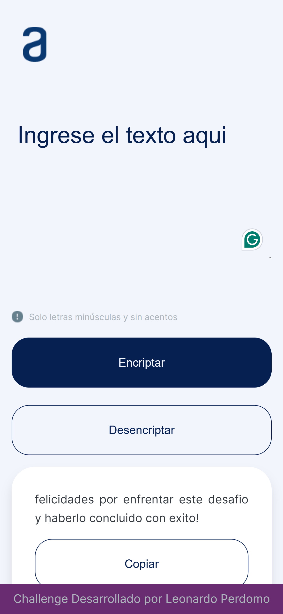
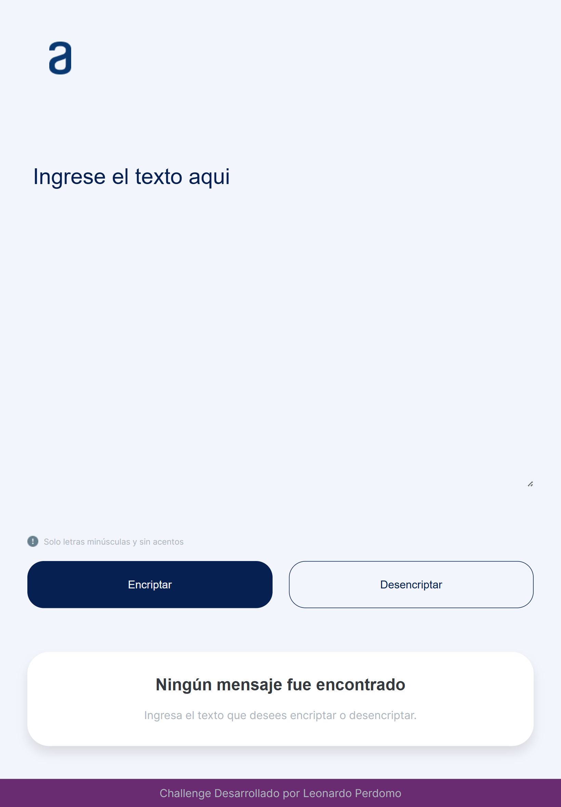
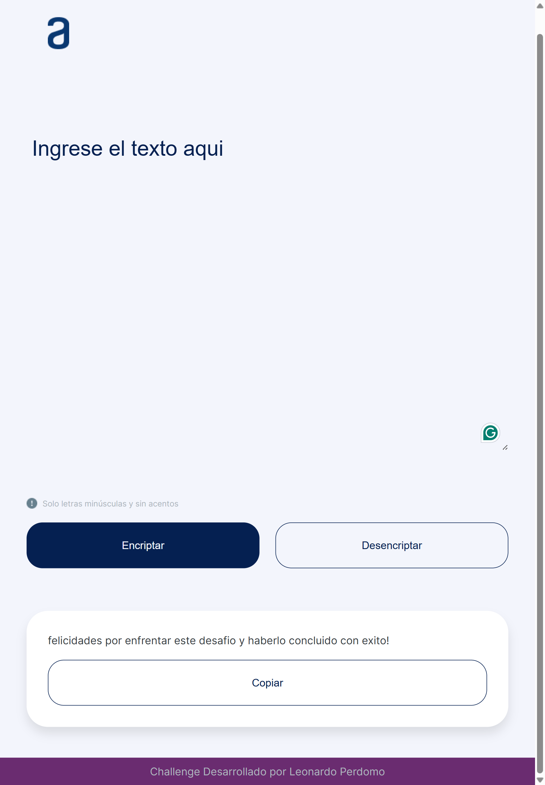

<h1 align="center">Desafio 1 - Alura Latam - Encriptador</h1>

<div align="center">
   Solucion al desafio de desarrollo de un encriptador de texto con JavaScript, HTML y CSS.
</div>


<!-- TABLE OF CONTENTS -->

## Contenido


- [Contenido](#contenido)
- [Descripción General](#descripción-general)
- [Construido Con](#construido-con)
- [Caracteristicas](#caracteristicas)
- [Como Usar](#como-usar)
- [Capturas de Pantalla](#capturas-de-pantalla)
  - [Desktop](#desktop)
  - [Responsive Design - Para Moviles](#responsive-design---para-moviles)
  - [Responsive Design - Para Tablets](#responsive-design---para-tablets)
- [Contacto](#contacto)


<!-- OVERVIEW -->

## Descripción General



El desafio consiste en desarrollar un encriptador de texto con JavaScript, HTML y CSS. El encriptador tiene dos campos de texto, uno para ingresar el texto a encriptar y otro para mostrar el texto encriptado. Ademas, tiene un boton para encriptar el texto y otro para copiar el texto encriptado al portapapeles.

Experiencia: Durante el desarrollo de este desafio, aprendi a manipular el DOM con JavaScript, a trabajar con eventos y a utilizar funciones de encriptacion de texto. Ademas, aprendi a utilizar la API de Clipboard para copiar texto al portapapeles. Por ultimo, aplique conocimientos de CSS para darle estilo al encriptador y hacerlo responsive, de modo que se adapte a diferentes tamaños de pantalla.

## Construido Con

- [HTML](https://developer.mozilla.org/es/docs/Web/HTML)
- [CSS](https://developer.mozilla.org/es/docs/Web/CSS)
- [JavaScript](https://developer.mozilla.org/es/docs/Web/JavaScript)
- [Clipboard API](https://developer.mozilla.org/es/docs/Web/API/Clipboard_API)

## Caracteristicas

- Encripta texto ingresado por el usuario.
- Copia el texto encriptado al portapapeles.
- Desencripta texto encriptado.

Las Reglas de encriptacion son las siguientes:

```bash
La letra "e" es convertida para "enter"
La letra "i" es convertida para "imes"
La letra "a" es convertida para "ai"
La letra "o" es convertida para "ober"
La letra "u" es convertida para "ufat"
```

Requisitos:

- Debe funcionar solo con letras minúsculas
- No deben ser utilizados letras con acentos ni caracteres especiales
- Debe ser posible convertir una palabra para la versión encriptada también devolver una palabra encriptada para su versión original.
Por ejemplo:
"gato" => "gaitober"
gaitober" => "gato"

## Como Usar

Para clonar y correr esta aplicación, necesitarás [Git](https://git-scm.com) y [Live Server](https://marketplace.visualstudio.com/items?itemName=ritwickdey.LiveServer) instalados en tu computadora. Desde tu terminal, corre:

```bash
# Clonar este repositorio
$ git clone https://github.com/leonardoapd/alura-latam-encriptador.git

# Instalar Live Server
$ npm install -g live-server

# Ir al directorio del proyecto
$ cd alura-latam-encriptador

# Correr Live Server
$ live-server
```

## Capturas de Pantalla

### Desktop



### Responsive Design - Para Moviles



### Responsive Design - Para Tablets




Abre tu navegador y navega a `http://localhost:5500/` para ver la aplicación en funcionamiento.

## Contacto

- Website [leonardo-perdomo](https://leonardo-perdomo.netlify.app/)
- GitHub [@leonardoapd](https://github.com/leonardoapd)
- Twitter [@leonardoapd](https://twitter.com/leonardoapd)